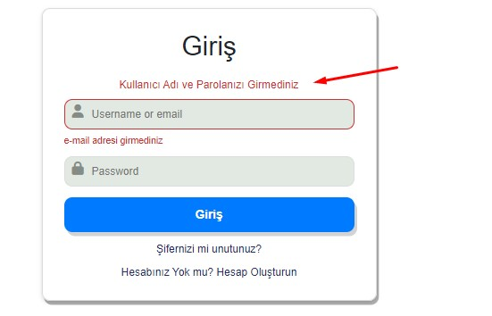
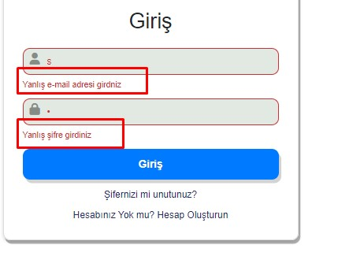
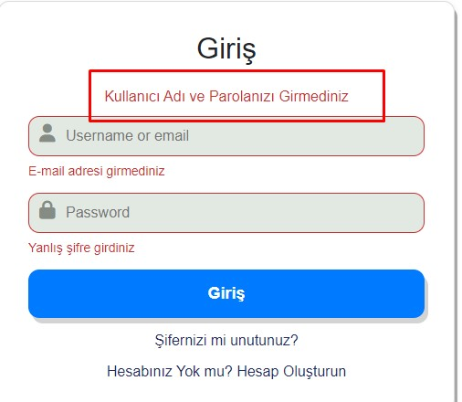

# OTURUM AÇMA VE KAYIT OLMA UYGULAMASI

Bu uygulamada çoğu şirketlerin, sosyal medyaların veya tüzel kişilerin kendi sayfalarını oluştururken kullanıcıların sayfaya katılması ve kullanıcı bilgisi tutmak için kullandıkları login alanını tasarlıyorruz. Bu uygulamada 2 farklı login tasarladık bir tanesi bir siteye ilk girerken kullandığımız hesap oluşturma logini diğeri ise kayıt olduktan sonra sadece mail ve şifremizle oturum actığımız login(giriş) alanı. Giriş alanımızı ve hesap oluşturma alanlarını  container içinde ve 2 farklı form classı altında oluşturduk. Aşağıdaki ilk resimde hesap oluştur logini yer almaktadır. Burada kullanıcı sayfaya kayıt olurken kullanıcıdan istenilen bilgiler yer almaktadır.


Aşağıdaki resimde ise oturum açma loginini tasarladık kullancı sadece mail adresi ve de şifresini yazarak siteye giriş yapabilecek.


## Giriş Alanının  Css Tasarımı ve JavaScript Kodları

Giriş alanımızı form classı altında oluşturuyoruz. Formun hemen altında bir tane <h1> Giriş</h1> tagı tanımlayarak başlığımızı oluşturuyoruz. Başlığımızın hemen altında ise div tagı tanımlıyoruz bu tagın içine de  f-message-error classını tanımladık. Kullanıcı giriş butonuna tıkladığında eğer  input alanlarına herhangi bir bilgi girmediyse başlığın hemen altında bir hata mesajı dönecek.



Hata mesajlarının yer aldığı divin altında da input-group classı oluşturarak inputlarımızı tnımlıyoruz. İlk input içinde kullanıcıdan mail adresini veya kullanıcı adını istiyoruz. Diğer input içinde de kullancıdan parolasını girmesini istiyoruz. Bu inputlar altına da div etiketleri altında *f-input-error-message* classlarını tanımlıyoruz. Kullanıcı bu inputlar içine herhangi bir bilgi girmediğinde veya yanlış email adresi veya da  paraloya yanlış girdiğinde hata mesajları gösterilecek.


Input alanlarımızı oluşturduktan sonra sayfaya bağlanmak için bir tane button oluşturduk. Butonun altına  da p tagları içinde a etiketi içinde Şifrenizi unutunuz mu ve de Hesabınız yok mu linklerini oluşturduk. Kullanıcı şifrenizi unutunuz mu linkine tıklarsa yeni şifre oluşturma sayfasına gidecek. Hesap Oluşturma linkine tıkladığı zaman da hesap oluşturma sayfasına yönledndirilecek.

### Giriş Alanının Css Tasarımı;

Body etiketine classlar vererek container içinde oluşturacağımız giriş ve hesap oluşturma alanlarını sayfanın  ortasına hizaladık. Body içinde kullanacağımız renkleri de body etiketi içinde tanımladık.

```css
body{
    --color-primary: #007bff;
    --color-dark:#007f67;
     --color-secondary:#252c6a;
     --color-error:#cc3333;
     --color-success:#4bb544;
     --border-radius:12px;

     margin: 0;

     display: flex;
     align-items: center;
     justify-content: center;
     font-size: 18px;
}
```

Body etiketitine cllasslar verdikten sonra oluşturduğumuz containerımızın genişiğini ve sayfa içindeki posizyonunu margin ve padding vererek ayarladık. Containerımızın kenarlarını border-radius özelliği ile hafif yuvarlattık.

```css
.container{
    width: 500px;
    max-width: 500px;
    margin: 16px;
    padding: 32px;
    border: 1px solid rgb(221, 219, 219);
    box-shadow: 0 3px 6px rgba(0, 0, 0, 0.16),
    3px 6px rgba(0, 0, 0, 0.30);
    border-radius: var(--border-radius);
    
}
```

Container içinde oluşturduğumuz her inputa focus özeliği ekledik. Kullanıcı input içine focus olduğunda gerçekleşecektir. Form içinde tanımladığımız mesaj ve başlık bölümlerinin boyutlandırılmasını ve hizalamasını *.f-title ve f.-message classları içinde tanımladık*.  Başlık altında div tagı tanımlamıştık. Input alanlarına herhangi bir değer girilmediğinde dönen mesajları bu div tagı içinde gözükecek.Bu div tagı içine *f-message-error,f-message-success* classları ekleyerek dönecek metinin rengini ayarlıyoruz.

- **.f-input-group classı içinde de inputların container içindeki pozisyonların ayarladık.** 

- **.f-input-group input[type=text], input[type=password],input[type=email]{  padding-left: 40px;}** inputiçinde padding-left vererek her input içine inputlarla ilgili iconlar ekliyoruz. Aşağıdaki resimde kırmızı oklarla iconlar gösterilmiştir. .icon classı altında iconların input içindeki konumu boyutu ve rengi ayarlanmıştır.

- ```css
  .icon{
      position: absolute;
      margin-top:6px;
      padding: 12px;
      min-width: 20px;
      color: #858b85 ;
  }
  ```

  

```css
.f-title{
    margin-bottom: 24px;
    text-align: center;
}

.f-message{
    margin-bottom: 12px;
    text-align: center;
}

.f-message-success{
    color: var(--color-success);
}
.f-message-error{
    color: var(--color-error);

}


.f-input-group{
    margin-bottom: 24px;
    position: relative;

}

.f-input-group input[type=text], input[type=password],input[type=email]{
    padding-left: 40px;
}

```

Aşağıda .f-input classı içinde ayrı oluşturduğumuz her inputun container içindeki boyutu konumu ve poziszyonunu aşağıdaki kodları kullanarak ayarladık. .f-input:focus clası tanımlayarak kullanıcı input içine tıkladığında inputun pozisyonunu değişecek.

```css
    
    .f-input{
    display: block;
    width: 100%;
    padding:12px;
    box-sizing: border-box;
    border-radius: var(--border-radius);
    border: 1px solid #dddddd;
    background: #e2e9e2;
    transition: background 0.3s, border-color 0.3s;

}

.f-input:focus{
   outline: none;
    border-color: var(--color-primary);
    background-color: #ffffff;
}

.f-input-error{
    color: var(--color-error);
    border-color:var(--color-error) ;
   
}

#f-input-error-message{
    margin-top: 8px;
    font-size: 14px;
    color: var(--color-error);
}
```

Her inputun altına div tanımlıyoruz. Hata mesajlarını bu div içinde gösterecek. Bu div'in id'lerinede  **#f-input-error-message** ile classlar vererek dönecek hata mesajalarının boyutunu rengini ve konumunu beliriyoruz. Aşağıdaki resimdeki bir sonuç gelecek.



İnput alanlarını oluşturduktan sonra buttonunda boyutunu konumunu rengini belirlemek için bir takım css kodları yazdık. Kullanıcı buton üzerine geldiğinde yani hover olduğunda butonun renginde ve kenarlarında renk değişiklikleri olacak. Kullanıcı buton tıkladığında ise yani buton aktif hale geleceği zaman butona basılıyor efekti ekledik transform **transform: translateY(6px);**  özelliğiyle.

```css
.f-button{
    width: 100%;
    padding: 16px 32px;
    font-weight: bold;
    font-size: 18px;
    color: #fff;
    border: none;
    border-radius: var(--border-radius);
    outline: none;
    cursor: pointer;
    background-color: var(--color-primary);
    box-shadow: 4px 6px lightgray;
    margin-bottom: 16px;
    transition: background-color 0.4s linear;

}
.f-button:hover{
    background: var(--color-dark);
    border: var(--color-dark);

}

.f-button:active{
    transform: translateY(6px);
}
```

|  |  |
| ------------------------- | ---------------------- |

Soldaki resimde butona tıklanmadan önceki hali mavi renkte. Sağ taraftaki resimde ise kullanıcı hem buton üzerine hover olmuş hem de butona tıklanmış hali yer almaktadır.

Buton altında yer alan p etiketleri içinde yer alan a etiketlerine de css özelikleri ekledik.Metinleri text-align:center classı ile ortaladık. .f-link classı altında da metinlerin rengini ve alt-çizgisni kaldırdık. .f-linke'e hover olayı vererek kullanıcı bu metinler üzerine gittiğinde bu metinlerin altı çizilecek.

```css
.f-text{
    text-align: center;

}
.f-link{
    color: var(--color-secondary);
    cursor: pointer;
    text-decoration: none;
}

.f-link:hover{
    text-decoration: underline;

}
```

Giriş alanı içine animasyon ekledik kullanıcı sayfaya giridiğinde login alanı ona animasyonlu bir şekilde gelecek. Uzaktan döne döne gelecek.

```css

.animationLog{
    animation:turnanimation 0.9s;

}

@keyframes turnanimation{
    from{transform:scale(0) rotate(360deg)}
    to{transform:scale(1) rotate(0) }
}
```

### Giriş Alanı Javascript Kodları;

Javascript kodlarını UI içinde yazdık. Fakat bazı fonksiyonlar içinde UI  kullanmadık. 

```javascript
function UI(){
   this.btnLogin= document.querySelector(".btn1"),
   this.createAcunt= document.querySelector("#createAccount"),
   this.forgetPassword = document.querySelector("#forgetPassword"),
   this.confirm= document.querySelector("#confirm"),
   this.loginEnter= document.querySelector("#loginEnter")
   this.showError = document.querySelector(".f-input")
   this.login1=document.querySelector("#login1")
}
```

function UI içinde input, buton ve tanımlamış olduğumuz p etiketleri içindeki class ve id değerlerini alıp oluşturduğumuz değişkenler içine atıyoruz.

```javascript
UI.prototype.setMessage = function(formElement, type, message){
    const messageElement= formElement.querySelector(".f-message");
    messageElement.textContent= message;
    messageElement.classList.remove("f-message-success", "f-message-error");
    messageElement.classList.add(`f-message-${type}`)

}
```

```html
  <div class="f-message f-message-error"></div>
```

UI prototype özelliğini kullanarak setMessage adı altında bir fonksiyon oluşturuyoruz. Bu fonksiyon dışarıdan 3 tane parametre alacak. Bu parametreler bana hangi form elemanının içinde olduğumuzu, type gönderilecek olan mesajın success mi, error mesajı olacak onu belirleyeceğiz, message de kullancıya gösterilen mesaj yer alacak.

- **const messageElement= formElement.querySelector(".f-message");** Hata mesajlarının gösterilmesi için oluşturduğumuz divi alarak yeni tanımladığımuz messageElement değişkeni içerisine atıyoruz.

- messageElementin textContentine kulanıcıya göstermek istediğimiz mesajı atıyoruz. Yani bu div içinde yer alacak olan mesaj.
- **messageElement.classList.remove("f-message-success", "f-message-error"); ** messageElementin clasListeesinde f-message-success classı f-message-error classı varsa bunları kaldıracak.   **messageElement.classList.add(`f-message-${type}`)** classListesine ekleyecek.


```javascript
const ui = new UI()
   document.addEventListener("DOMContentLoaded", ()=>{
        const loginForm = document.querySelector("#loginArea")
        const createNewAccount = document.querySelector("#accountArea")
  
        ui.createAcunt.addEventListener("click", e =>{
            e.preventDefault()
            loginForm.classList.add("f-none");
        
            createNewAccount.classList.remove("f-none")
        });

        ui.loginEnter.addEventListener('click', e =>{
            e.preventDefault();
            loginForm.classList.remove("f-none");
            loginForm.classList.add("animationLog")
            createNewAccount.classList.add("f-none")
        })
 

```

Giriş alanı sayfaya yüklendiğinde  DomContentLoaded olayı çalışacak.  Oluşturmuş olduğumuz giriş ve hesap oluştur alanlarının id lerini oluşturmuş olduğumuz loginForm ve CreateNewAccount değişkenleri içerisine aktarıyoruz. **Tasarım alanını oluştururken hesap oluşturma formunun içine f-none classını ekledik sayfa yüklendiğinde bize Login(Giriş) alanı gelecek**

createAccount (p etkieti içinde tanımlamış olduğum hesabınız yok mu) ve loginEnter' a(p etilketi içindeki önceden hesap oluşturdum) click olayı veriyoruz. 

createAccount'a tıkladığımda loginForm içine f-none(display:'none') ekleyecek. createNewAccount içinden de f-none classını kaldıracak. LoginForm yani **GİRİŞ ** alanı kullanIcıya gösterilmeyecek **Hesap oluşturma** alanı kullanıcıya gösterilecek.

loginEnter'a (önceden hesap oluşturdum.) tıkladığımızda ise loginFomr içindeki f-none classı kalkacak ve createNewAccount içine f-none classı eklenecek. 

```javascript
       loginForm.addEventListener("submit", e =>{
            e.preventDefault();
   if(this.login1.value==="" & this.password1.value ===""){
                    ui.setMessage(loginForm,"error", "Kullanıcı Adı ve Parolanızı Girmediniz")
            }else{
                 ui.setMessage(loginForm,"success"," Hoşgeldiniz")
                ui.clearInput()
            }
      
          
        })
```

loginForm' a submit olayı ekliyoruz kullanıcı loginArea içinde bulunan butona tıkladığında bize setMessage fonksiyonu çalışacak.  if parametresi oluşturduk eğer username yada email adresi boş ve password alanı boş olduğunda biz butana tıklarsak hata mesajı dönecek. setMessage fonksiyonun formElementine loginForm dedik, type error dedik, ve göstermek istediğimiz mesjada Kullanıcı adı ve parolanızı girmediniz diyoruz.



Eğer 2 input içine de değer giridiğimiz de bize Hoş Geldiniz yazısını döndürecek.


```javascript

UI.prototype.showInputError=function(showElement,message) {
    showElement.classList.add("f-input-error");
   
    showElement.parentElement.querySelector("#f-input-error-message").textContent=message;
}

UI.prototype.deleteInputError=function(showElement){
    showElement.classList.remove("f-input-error");
    showElement.parentElement.querySelector("#f-input-error-message").textContent="";
}
```

İnputların içine yanlış bir bilgi veya istenilenin dışında veri girildiğinde hata mesajları dönderilecek. showInputError fonksiyonu ile showElementin yani seçilen input elemanının içine *f-input-error* classını ekle.İnputun kenarlarını kırmızı renge boyayacak. showElement.parentElement diyerek *#f-input-error-message*.text-contetine de hata mesajını gönderiyoruz. show.parent element ile aşağıdaki resşmde ok ile gösterilen div'i kastediyoruz.

 

```javascript

    document.querySelectorAll(".f-input").forEach(showElement=>{
        showElement.addEventListener("blur", e=>{
          
```

Yukarıdaki kodda querySelectorAll(".f-input")  ve forEach ile bütün input elamanlarını seçip bir fonksiyon  oluşturuyoruz. Oluşturduğumuz fonksiyonla her input içine blur olayı ekliyoruz kullancı input içinden çıktığı anda bize hata mesajı dönecek.


```javascript

    document.querySelectorAll(".f-input").forEach(showElement=>{
        showElement.addEventListener("blur", e=>{
          
        var regex = /^[a-zA-Z0-9._-]+@([a-zA-Z0-9.-]+.)+([.])+[a-zA-Z0-9.-]{2,4}$/;
          
        if(e.target.id==="login1"  && regex.test(e.target.value)==false){
                    
          ui.showInputError(showElement,"Yanlış e-mail adresi girdniz")
         }
                if(e.target.id==="login1" && e.target.value === ""){
                 
                        ui.showInputError(showElement,"E-mail adresi girmediniz")
         
                }
```

Kullanıcı login1 id'sine sahip input alanına mail adresini  uygun şekilde girmez ise hata mesajı dönecek. Var regex değişkeni içerisine **/^[a-zA-Z0-9._-]+@([a-zA-Z0-9.-]+.)+([.])+[a-zA-Z0-9.-]{2,4}$/;**  bu kodları yazıyoruz. Login1 idsine sahip input içine boş bir değer girdiğimizde de bize *email adresi girmediniz* şeklinde bir hata mesajı dönderecek.

```javascript

            if(e.target.id==="password1" && e.target.value.length<7 && e.target.value.length<12){
            ui.showInputError(showElement,"Yanlış şifre girdiniz")
            }

```

Yukarıdaki koda da giriş alanında password1 id'sine sahip inputa şifre bilgisini belli kriterler dahilinde girilmesi isteniyor. Kullanıcının girdiği şifre uzunluğu 7 karakterden küçük ve 12 karakterden fazla olamaz, olursa *yanlış şifre girdiniz* bir hata mesajı dönecek.


## Hesap Oluşturma Tasarımı ve JavaScript Kodları;


Hesap oluşturma alanında kullanıcıdan adını ve soyadını, kullanıcı adı, email adresini, password bilgisini, yaşını ve cinsiyet bilgilerini istiiyoruz. Hepsini ayrı ayrı input grupları içinde oluşturduk. Giriş alanında kullandığımız css kodlarının aynısını hesap oluştur alanında da kullanıyoruz. Butonun altında p etiketi içine tanımlamış olduğumuz *önceden hesap oluşturdum. Giriş yapın* kullanıcı bu yazıya tıklarsa giriş sayfasına yönledirecek.

## Hesap Oluştur JavaScript Kodları;

```javascript
     if(e.target.id==="firstName"  && e.target.value.length < 2){
                ui.showInputError(showElement,"Kullaıcı adı uzunluğu en az 3 karakter olmalı")
            }
            
```

- Kullanıcıdan  firstName id'sine sahip input içine Ad ve soyad bilgisi girilmesi isteniyor kullanıcı eğer 3 karakterden az karakter girdiğinde *Kullanıcı adı uzunluğu en az 3 karakter olmalı* şeklinde bir hata mesajı dönecek. 

```javascript
     if(e.target.id==="signUsername"  && e.target.value.length>0 && e.target.value.length<6){
                ui.showInputError(showElement,"Kullanıcı adı en az 6 karakterli olmalı")
            }
```

- signUsername ıd'sine sahip input içinde de kulanıcıdan username bilgisi istenmektedir. Kullanıcının gireceği username bilgisinin karakter uzunluğu en az 6 karakter olmalı. Altıdan az  karakter girerse hata mesajı dönecek.

```javascript

            if(e.target.id==="signEmail"  && regex.test(e.target.value)==false){
                ui.showInputError(showElement,"email adresini  yanlış girdiniz")
            }
```

- signEmail id'sine sahip input içinde de kullanıcıdan email bilgisi girmesi isteniyor. İstenilen email bilgisi email standartlarına uygun değilse bir hata mesajı dönecek.

```javascript
     if(e.target.id==="signPassword" && e.target.value.length < 6 && e.target.value.length<10){
                ui.showInputError( showElement," Şifreniz en az 6 karakter en fazla 12 karakter olamalı")
            }

```

- signPassword id'sine sahip input içinde kullanıcıdan bir parola girmesi isteniyor. Kullanıcıdan girmesi istenen şifre karakter sayısı en az 6 karakter ile en fazla 12 karakter arasında olmalı. 6 karakterden az veya 12 karakterden az karakter girerse hata mesajı dönecek.


```javascript
 const password= document.querySelector("#signPassword").value.length;
 const confirmPassword = document.querySelector("#confirmPassword").value.length
      if(e.target.id==="confirmPassword" && password !== confirmPassword ){
        ui.showInputError(showElement,"Parololar benzer değil")
            }
```

- confirmPassword id'sine sahip input içinde replay password tanımlıyoruz. Bu inputu önceden girdiğimiz password bilgisini doğrulamak için oluşturduk. const password ve const confirmPassword değişkenlerini  tanımlıyoruz. Bu değişkenler içine ilgili input içine girilen değerin uzunluğunu ekliyoruz. Eğer confirmPasswordun uzunluğu eşit değilse passworda bana *parololar benzer değil* şeklinde hata mesajı dönderecek.

```javascript
     if(e.target.id==="agee" && e.target.value<18){
                ui.showInputError(showElement,"18 yaşından küçüksünüz")
            }

```

- agee id'sine sahip input içinde kullanıcıdan yaş bilgisi istenmektedir. Kullanıcıdan istenen yaş 18 den küçükse kullanıcı bu siteye kayıt olamaz.

```javascript
  document.querySelector("#man").addEventListener("click",()=>{
            document.querySelector("#woman").disabled = true
            
          document.querySelector("#man").checked = true
            
          })
          document.querySelector("#woman").addEventListener("click",()=>{
            document.querySelector("#man").disabled = true
            document.querySelector("#woman").checked = true
          })
```

- Kullanıcıdan hesap oluştururken cinsiyet bilgisi de istenmektedir. Kullanıcı kadın veya erkek seçeneklerinden herhangi birini seçtikten sonra seçeneğini değiştiremez. man id'si içinde kulllanıcı erkek seçeneğini seçerse form-check active olacak yani seçilmiş olacak kadın seçeneği ise disabled olacak. Aynı durum kadın form-checki içinde geçerli kullanıcı kadın seçeneğini seçerse kadın seçeneği active edilmiş olacak erkek seçeneği disabled olacak.


Yukarıdaki resimde input içine  yanlış bilgi girildiğinde dönecek olan mesajlar gösterilmiştir.

Kullanıcı password bilgisini girerken girdiği password bilgisini input içine kontrol edebilmesi için 2 tane ikon *fa-solid fa-eye-slash* ve *fa-solid fa-eye*  ekliyoruz kullanıcı input içinde bilgiyi girerken şifre ona gösterilmeyecek isterse kendisi ikon üstüne gelip tıkladığında girdiği password bilgisini görecek. 

|  |  |
| ------------------------ | ------------------------ |


```html
    <div class="  f-input-group">
        <i class="fa-solid fa-lock icon fw-fa fa-lg"></i>
        <i class="fa-solid fa-eye  geye fa-lg hide1" onclick="showPassword()"></i>
        <i class="fa-solid fa-eye-slash  geye fa-lg hide2" onclick="showPassword()"></i>
        <input type="password" class="f-input" id="signPassword" autofocus placeholder="Password">
        <div id="f-input-error-message"></div>
      </div>
```

Password kullanıcıya gösterilmesi için i classları içinde onclick fonsksiyonu oluşturuyourz. Kullancılar ikona tıkladığında çalışacak olan fonksiyondur.

Aşağıda gördüğünüz kodlarda onclick'e tıklandığında çalışacak olan fonksiyon gösterilmiştir. Bu fonksiyon içinde 3 tane değişken tanımlıyoruz. signPassword id bilgisini password değişkeni içerisine atıyoruz. İkonlar içinde hide1 ve hide2 classları oluşturuyoruz. hide1 classı şifrenin gösterileceği ikonu temsil etmekte. hide2 classı ise şifrenin gösterilemeyeceği ikonu temsil etmekte. İf karar yapısı içinde eğer password type = input içinde girilen type eşit ve tip olarak benziyor ise password.type içine text type'nı ekleyecek. Eye değişkeni içerisindeki ikon gözükecek ve şifre kullanıcıya gösterilecek. Eğer eye ikonuna tıkladığımız bu kez şifre gösterilmeyececek eye ikonu eyeSlash iconu olacak. Sağdaki resimde görüldüğü gibi.

```javascript
function showPassword(){
    const password = document.querySelector("#signPassword")
    const eye = document.querySelector(".hide1")
    const eyeSlash = document.querySelector(".hide2")
    if(password.type==="password"){
        password.type = "text";
        eye.style.display="block";
        eyeSlash.style.display= "none"
    }else{
        password.type = "password";
        eye.style.display="none";
        eyeSlash.style.display= "block"
    }
}
```

Bu kodun ve fonksiyonun aynısını ReplayPassword içinde yapıyoruz. ReplayPassword alanında kullanıcı ikonlar üzerine tıklayarak girdiği şifreyi görebilecek.

